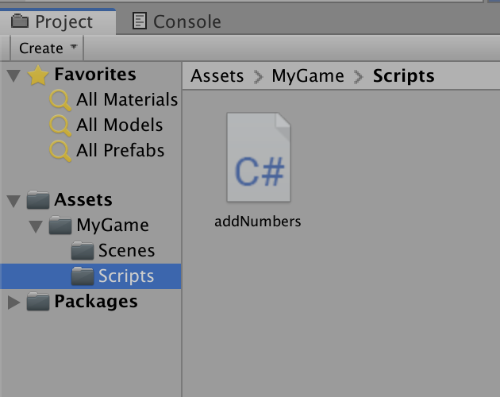

# MyThirdScript-cs-lhell

Project Description:

The aim of this project is twofold:

    First, practicing the git/GitHub workflow, writing a REAMDE
    Second, first time using a debug message with concatinations of strings and variables

Development Platform:

    MacOS, Unity version 2019.1.14f1, Visual Studio Code 2019
    
Target Platform:

    WebGL (RefRes: 1280x720 HD-720p)
    
Screenshots:

Lessons Learned:

    Basic Practice with unity project on GitHub, coding Debug message
    How to add Screenshots in VisualStudio
